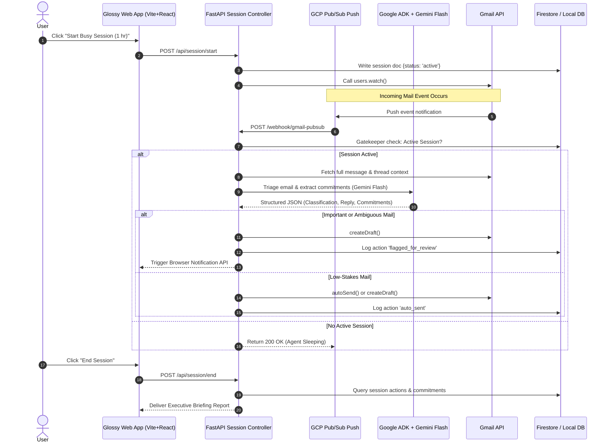

# Architecture & Technical Specs — Project Glossy

## Layer-by-Layer System Specs

## Data Schema (Firestore / DB)

### `sessions`
- `session_id`: String (PK)
- `status`: `'active'` | `'completed'`
- `start_time`: Timestamp
- `duration_minutes`: Number
- `stats`: `{ total_triaged, auto_sent, drafted, flagged, commitments_logged }`

### `mail_actions`
- `action_id`: String (PK)
- `mail_id`: String
- `session_id`: String (FK)
- `sender`: String
- `subject`: String
- `classification`: `'important'` | `'low-stakes'` | `'spam'` | `'newsletter'`
- `reply_needed`: `'yes'` | `'no'` | `'ambiguous'`
- `action`: `'auto_sent'` | `'drafted'` | `'flagged_for_review'` | `'ignored'`
- `reasoning`: String
- `suggested_reply`: String

### `commitments`
- `commitment_id`: String (PK)
- `mail_id`: String
- `session_id`: String
- `owner`: String
- `task`: String
- `to`: String
- `deadline`: String
